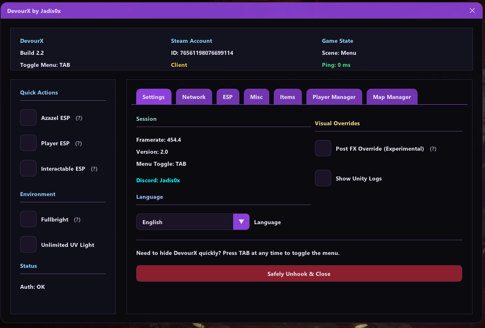
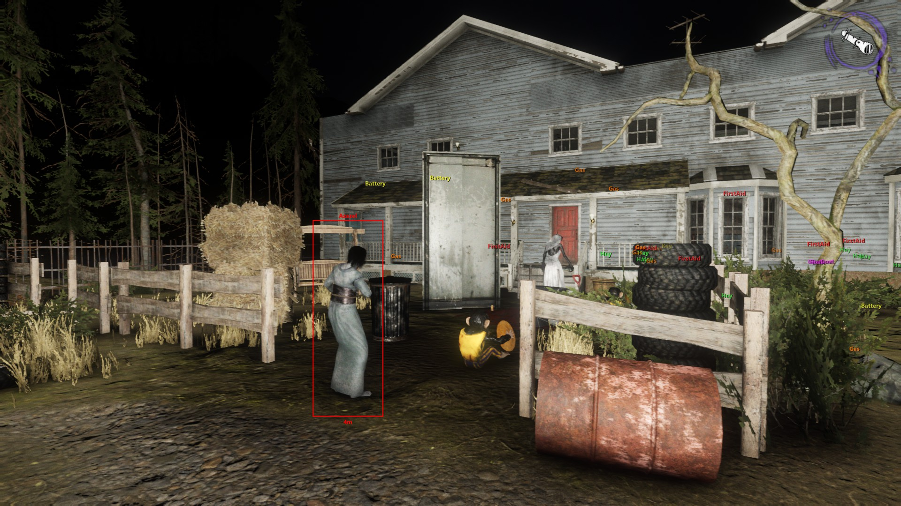

# DevourX

DevourX is an open-source C++ mod menu developed specifically for the co-op horror game Devour.





## Requirements
- Windows 10/11 64-bit
- A legitimate copy of Devour installed via Steam or another supported platform
- Microsoft Visual C++ Redistributable (x64) installed [Download here](https://www.techpowerup.com/download/visual-c-redistributable-runtime-package-all-in-one/)

## Quick Start Installation

#### 1. Download the files
Get the latest release from this repository's [Releases](https://github.com/jadis0x/DevourX/releases) section.

The package now includes:
- version.dll
- localization/ folder
- localization/config.json

#### 2. Locate your Devour installation folder
 - Default Steam path (might differ):
```
C:\Program Files (x86)\Steam\steamapps\common\Devour
```

#### 3. Copy all files
 - Extract everything into the main game directory, the same folder as Devour.exe

#### 4. Launch the game
 - Start Devour normally through Steam or a shortcut.
 - The game will automatically detect and load DevourX.

#### 5. Activate the menu
 - Once in-game, press `TAB` key to open or close the DevourX menu.

## Available Features
- Fullbright
- Unlimited UV Light
- UV Light Color Customizer
- Prefab Spawner
- Force Lobby Start
- Unlock Robes
- Unlock Doors
- Disable Long Interact
- Instant Win
- Azazel Speed Modifier
- Player Speed Modifier
- Fly
- Kill / Revive / Jumpscare Players
- ESP (Players, Azazel, Objects)
- EXP Modifier
- Create Lobby Without Player Limit
- SteamID & Name Hook
- Ghost Join

## Language Support
DevourX ships with multi-language localization files. The in-game menu can be switched between:

- 🇺🇸 English (`en-US`)
- 🇹🇷 Turkish (`tr-TR`)
- 🇨🇳 Simplified Chinese (`zh-CN`)
- 🇰🇷 Korean (`ko-KR`)

By default, DevourX prompts you to pick a language on startup. You can change the language at any time from the **Settings → Language** tab inside the menu or by editing `localization/config.json` (`localizationCulture`).

### Adding new languages
To contribute another language:

1. Duplicate `localization/en-US.json` (or whichever language is closest) and name the copy with your locale code, e.g. `localization/es-ES.json`.
2. Translate each string value while keeping the JSON keys intact. Values support standard ImGui formatting tokens such as `%s` and `%d`—leave those placeholders untouched so runtime substitutions keep working.
3. Update the `languages` map at the top of the file so DevourX can display your language name in the selection dropdown.
4. (Optional) Set your locale as the default by adjusting `localization/config.json` if you want to test it immediately.

Submit the updated JSON file(s) through a pull request.

## Uninstalling
1. Close Devour.
2. Delete the `version.dll`.

## Security and Ethics
- Respect the experience of other players in online lobbies.
- This repository does not encourage cheating in any way; it is intended solely for modding and technical research.

## Support & Contact
If you'd like to support future development, you can donate here:

- [BuyMeACoffe/jadis0x](https://buymeacoffee.com/jadis0x)
- [PayPal/jadis0x](https://www.paypal.com/paypalme/jadis0x)
- Discord: Jadis0x

